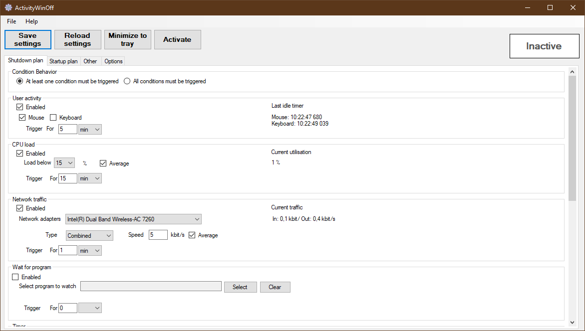
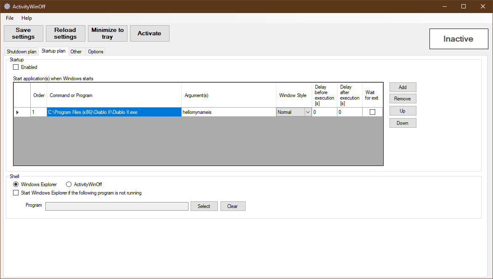
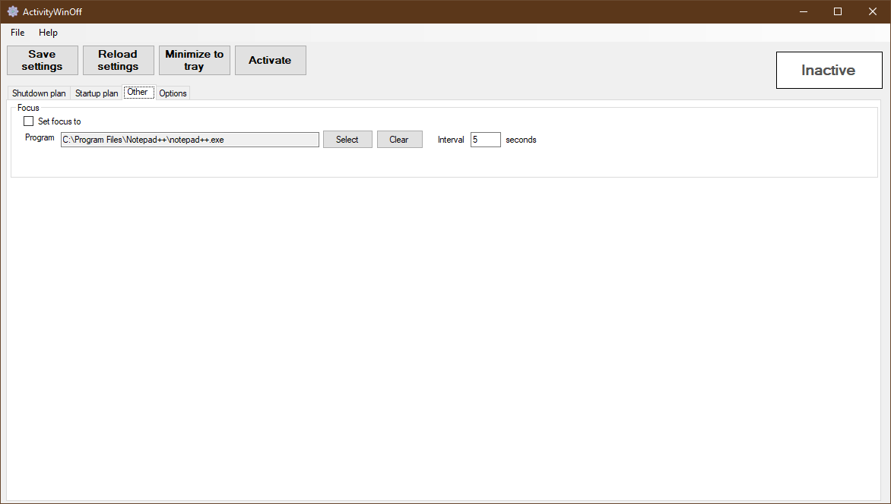
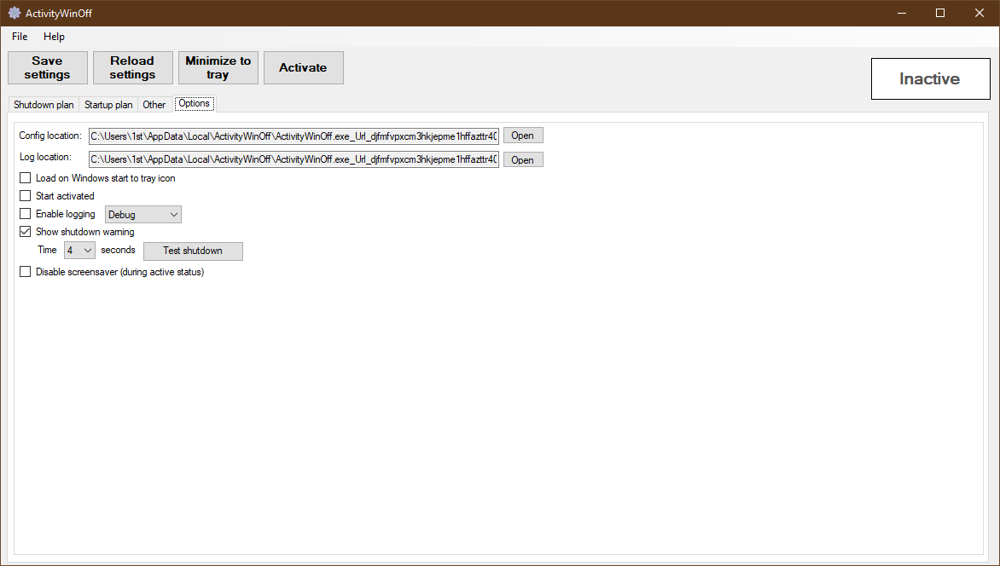

### ActivityWinOff
ActivityWinOff is an .NET 8 application for:
* Scheduling shutdown of windows based on one or more conditions. Some of the features are:
  * Time
  * User activity (Mouse and/or keyboard)
  * Network activity (average or below)
  * CPU load (average or below)
  * Timer and/or specific time
  * Wait for program
  * Perform action(s) 
* Planning startup of Windows. Some of the features are:
  * Load (activated) automatically on startup
  * Change default shell
  * Perform action(s)
* Other features to be mentioned are:
  * Windows 10 compatible (only tested)
  * Focus application
  * Commandline support
  * Action(s) support run minizied, delays, wait for exit

    
    
    
    

If you find this application helpful, a small donation is always appreciated, .

## Install
.NET Framework 8.0 Runtime must be installed. Found [here](https://dotnet.microsoft.com/en-us/download/dotnet/8.0)

Download most [recent release](https://github.com/Meliox/ActivityWinOff/releases) and run installer.

## Build
Install .NET 4.8.

Clone source and set "ActivityWinOff" as Startup Project.
Build installer: Installer > Build.

Pull requests are most welcome for new features and patches.